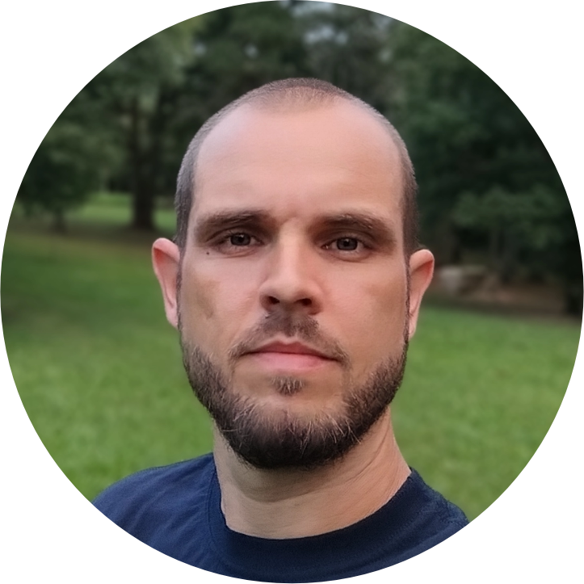

# JMATTOS.DEV

Portfólio profissional de **Julio Mattos** — Full Stack Developer & Automação de Processos (RPA).



## 📚 Documentação

- [**DEPLOY.md**](DEPLOY.md) — guia completo de deploy no domínio (SFTP + Nginx + deploy automático/hot-reload)
- [**AI_GUIDELINES.md**](AI_GUIDELINES.md) — padrões, regras e orientações para IAs que trabalharem neste projeto

## 📋 Projeto

Site pessoal/portfólio **estático** construído com **Vite + Tailwind CSS v4**, com tema escuro (dark), tipografia _Space Grotesk / Inter / JetBrains Mono_ e micro-interações (reveal on scroll, menu mobile, ícones Lucide). Todas as seções são montadas a partir de arquivos de dados em `src/js/data/`, o que facilita a manutenção sem tocar no HTML.

Seções atuais:

- **Hero** — apresentação com terminal decorativo (exemplo Django/Python)
- **Sobre** — texto da trajetória + foto de perfil com moldura em gradiente azul e aura
- **Stack** — tecnologias com indicador de nível (frontend, backend e infra/tools)
- **Projetos** — cards gerados dinamicamente (estudo de caso com screenshots e links)
- **Processo** — etapas de trabalho (Entender → Planejar → Desenvolver → Entregar)
- **Serviços** — cards gerados dinamicamente
- **Presença profissional** — redes/links externos
- **Contato** — e-mail direto + formulário (mailto, sem backend)

## 🎯 Objetivo

Apresentar a trajetória, a stack e os serviços de forma clara e profissional, servindo como vitrine para oportunidades de trabalho e novos projetos. O foco é **simplicidade, performance e atenção aos detalhes**, com código organizado e de fácil manutenção — dados separados do HTML (arquivos `data/` como fonte única de verdade).

## 🧰 Stack (Tecnologias)

| Camada    | Tecnologias                                             |
| --------- | ------------------------------------------------------- |
| Frontend  | HTML5, CSS3, JavaScript (ES Modules)                    |
| Estilos   | Tailwind CSS v4 (configuração _CSS-first_)              |
| Build     | Vite                                                    |
| Ícones    | Lucide (via tree-shaking no bundle)                     |
| Fontes    | Space Grotesk, Inter, JetBrains Mono (Google Fonts)     |
| Deploy    | CloudPanel / VPS (Nginx + extensão SFTP + deploy automático) |

> Backend das aplicações em destaque: Python/Django e Node.js/Express (ver [DEPLOY.md](DEPLOY.md) e `src/js/data/projects.js`).

## 🚀 Como executar localmente

Requisitos: **Node.js 20+** e **npm**.

```bash
# 1. Instale as dependências
npm install

# 2. Inicie o servidor de desenvolvimento
npm run dev
```

O projeto estará disponível em **http://localhost:5173/** (com _hot reload_).

> **Nota (WSL/Windows):** se `npm run dev` falhar por roteamento ao `CMD.EXE`, execute diretamente:
> `node node_modules/vite/bin/vite.js`

## 🛠️ Como fazer o build

```bash
# Gera os arquivos otimizados de produção em /dist
npm run build

# Gera o build e recompila automaticamente a cada alteração no código (usado no deploy com hot-reload)
npm run build -- --watch

# Pré-visualiza o build de produção localmente
npm run preview
```

## 🚢 Deploy

O site é **estático** e publicado no domínio via **CloudPanel (VPS) + extensão SFTP do VSCode**, com deploy automático a cada alteração salva (hot-reload). O guia completo está em **[DEPLOY.md](DEPLOY.md)** e cobre:

- Estrutura de sites do CloudPanel (web root em `/home/<site>/htdocs/<dominio>/`)
- Criação do site no CloudPanel (Runtime: **Static**) e emissão do SSL (Let's Encrypt)
- Configuração do `sftp.json` apontando para o web root (upload automático ao salvar)
- DNS apontando para a VPS (registro A sem proxy)
- Atualizações futuras e solução de problemas

## 📁 Estrutura básica

```
jmattosdev/
├── index.html              # HTML principal (todas as seções)
├── package.json            # Dependências e scripts
├── vite.config.js          # Config do Vite (plugin Tailwind v4)
├── .gitignore              # Arquivos ignorados pelo Git
├── DEPLOY.md               # Guia de deploy (SFTP + Nginx)
├── AI_GUIDELINES.md        # Regras e padrões para IAs do projeto
├── public/                 # Arquivos estáticos servidos na raiz
│   ├── favicon.svg
│   ├── jmattos.webp
│   ├── robots.txt
│   ├── sitemap.xml
│   └── screenshots/        # Screenshots dos projetos (projeto-1.gif, projeto-2.png)
└── src/
    ├── css/
    │   └── style.css       # Design tokens + Tailwind CSS v4 (CSS-first)
    └── js/
        ├── main.js         # Ponto de entrada (ícones + renderização)
        ├── projects.js     # Renderiza a seção Projetos
        ├── servicos.js     # Renderiza a seção Serviços
        ├── presenca.js     # Renderiza a seção Presença profissional
        ├── contato.js      # Inicializa a seção Contato
        ├── reveal.js       # Animação reveal on scroll
        └── data/           # Fontes únicas de verdade (dados)
            ├── projects.js
            ├── servicos.js
            ├── presenca.js
            └── contato.js
```

---

_© JMATTOS.DEV — Julio Mattos_
