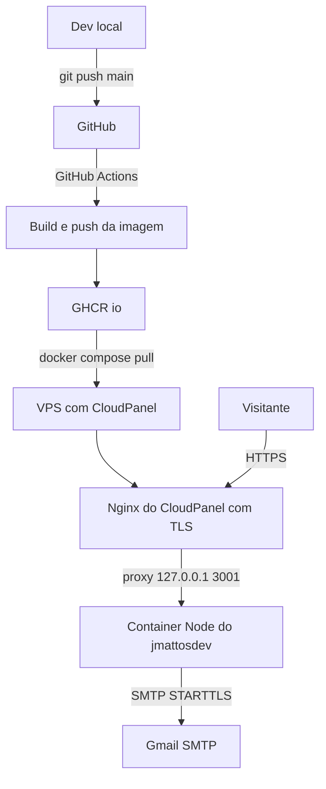
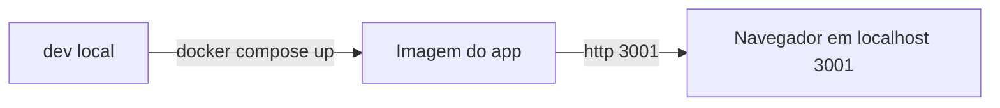

# Plano — Conteinerização do JMATTOS.DEV com Docker, Compose, GHCR e GitHub Actions

> **Objetivo:** sair do deploy atual (CloudPanel + SFTP + PM2/processo Node no web root) para uma
> estratégia **reproduzível** de conteinerização, com a mesma aplicação ([`server.js`](server.js:1) servindo
> o build do Vite + `POST /api/contato`) rodando como **container Docker** atrás do **Nginx já existente
> do CloudPanel**, publicada no **GHCR** e implantada por **GitHub Actions + SSH + docker compose pull/up**.
>
> **Decisão confirmada pelo dono:** manter a VPS com CloudPanel; container **apenas do app Node**;
> Nginx/TLS/domínio permanecem sob responsabilidade do CloudPanel; artefato distribuído via GHCR.

---

## 1. Levantamento inicial — fatos constatados no projeto

| Item | Constatação | Impacto no plano |
| --- | --- | --- |
| Tipo de app | SPA estática gerada pelo Vite ([`vite.config.js`](vite.config.js:1)) + servidor Express ([`server.js`](server.js:27)) | Precisa de **estágio de build** (Vite/Tailwind são `devDependencies`) e de **runtime Node**, não Nginx |
| [`Dockerfile`](Dockerfile:1) | Contém apenas `FROM nginx:alpine` (esboço) | Deve ser **substituído**: imagem Nginx serviria só `dist/` e mataria `POST /api/contato` |
| Porta | `process.env.PORT \|\| 3001` ([`server.js`](server.js:28)) | Container escuta **3001**; publicar só em loopback |
| Proxy / IP real | `app.set("trust proxy", 1)` ([`server.js`](server.js:33)) | X-Forwarded-For do Nginx do CloudPanel precisa continuar chegando ao Express (rate limit por IP real) |
| Health check | `GET /status` → `OK` ([`server.js`](server.js:66)) | Base pronta para `HEALTHCHECK` do Docker e para smoke test em CI |
| Graceful shutdown | `SIGTERM`/`SIGINT` com `server.close()` ([`server.js`](server.js:213)) | Compatível com `docker stop`; ajustar `stop_grace_period` |
| Estado / banco | **Sem banco de dados** por decisão de projeto ([`AI_GUIDELINES.md`](AI_GUIDELINES.md:217)) | App **stateless** → sem volumes de dados, apenas persistência de configuração/segredos |
| Segredos | `SMTP_USER`, `SMTP_PASS`, `SMTP_TO` por variável de ambiente ([`server.js`](server.js:75)) | Injetar via `env_file`/secrets no Compose; **nunca** no Dockerfile |
| Config sensível local | `.env`, `ecosystem.config.js`, `ecosystem.config.cjs` já ignorados ([`.gitignore`](.gitignore:27)) | Falta criar `.env.example` (a exceção `!.env.example` já existe) |
| Deploy atual | SFTP + `npm install --omit=dev` + processo Node/PM2 no web root ([`DEPLOY.md`](DEPLOY.md:226)) | A virada para container **exige desligar** o processo Node do CloudPanel/PM2 (conflito na porta 3001) |
| Runtime da VPS | Node v22.x (caminho NVM citado em [`DEPLOY.md`](DEPLOY.md:284)) | Alinhar a imagem base em Node 22 Alpine |
| Testes | Não há framework de teste no [`package.json`](package.json:6) | Usar `node --test` (built-in) + smoke test do container — **sem novas dependências** |
| Dependência suspeita | `lucide` está em `dependencies` ([`package.json`](package.json:20)) mas só é usada no bundle do Vite | Otimização opcional: mover para `devDependencies` (requer aprovação do dono) |
| Documentação | [`DEPLOY.md`](DEPLOY.md:1), [`README.md`](README.md:77) e [`AI_GUIDELINES.md`](AI_GUIDELINES.md:1) descrevem o fluxo SFTP | Precisam ser atualizados ao final para refletir o fluxo Docker |

### 1.1 Checklist de levantamento (a confirmar antes de codificar)

- [ ] Acesso SSH à VPS como usuário do site + possibilidade de `sudo` (necessário para `systemctl` do CloudPanel e para Docker, se não rootless).
- [ ] Docker + Docker Compose v2 já instalados na VPS (ou autorização para instalar).
- [ ] Como o site NodeJS do CloudPanel mantém o processo no ar (serviço `systemd`/PM2/`clpctl`) — para desligá-lo com segurança.
- [ ] Vhost exato do CloudPanel que faz proxy para `127.0.0.1:3001` (confirmar se aponta para a porta que publicaremos).
- [ ] Arquitetura da VPS (esperado `linux/amd64`) para definir a plataforma de build da imagem.
- [ ] Disponibilidade da conta GitHub/GHCR e permissão para criar PAT com `read:packages` na VPS.
- [ ] Confirmar que os valores de SMTP continuam válidos (App Password não expirada).

---

## 2. Requisitos e restrições

**Requisitos funcionais**
1. Site (SPA) servido em HTTPS no domínio, sem regressão visual ou de cache.
2. `POST /api/contato` continua entregando e-mail via SMTP/Gmail com as proteções atuais (validação, honeypot, rate limit).
3. `GET /status` continua respondendo `200 OK` (usado por monitoramento e health check).
4. Mesmos headers de segurança HTTP já enviados pelo Express (HSTS, nosniff, frame-options etc.).

**Requisitos não funcionais**
1. Imagem final enxuta, sem `devDependencies`, sem código-fonte (`src/`), sem `node_modules` do host.
2. Container **não-root**, com filesystem somente leitura quando possível.
3. Build **determinístico** (`npm ci` + lockfile), imagem **imutável por tag de commit**.
4. Deploy reprodutível e reversível em poucos comandos (rollback por tag).
5. Zero segredo em imagem, em repositório ou em log.
6. Paridade dev/prod: o mesmo `Dockerfile` e o mesmo Compose rodam local e na VPS.

**Restrições**
1. **Não** introduzir banco, SSR ou frameworks ([`AI_GUIDELINES.md`](AI_GUIDELINES.md:217)).
2. **Não** adicionar dependências sem aprovação ([`AI_GUIDELINES.md`](AI_GUIDELINES.md:215)).
3. Servir arquivos via Express permanece o modelo ([`server.js`](server.js:52)) — Nginx do CloudPanel é o proxy de borda.
4. O web root do CloudPanel permanece sendo a referência do site (SSL/vhost), mas o app deixa de ser executado a partir dele.

---

## 3. Decisões de arquitetura recomendadas

| Tema | Decisão recomendada | Justificativa / alternativa descartada |
| --- | --- | --- |
| Imagem base | `node:22-alpine` (fixada por tag exata, idealmente por digest) | Alinha com o Node 22 da VPS; Alpine reduz tamanho. Descartado `node:22` (Debian) por peso e `nginx` por não executar o Express |
| Estrutura | **Multi-stage**: `builder` (npm ci completo + `npm run build`) → `runtime` (npm ci `--omit=dev` + `dist/` + `server.js`) | Vite/Tailwind/Lucide são build-time; a imagem final fica com 4 dependências de runtime |
| Processo | **Um único container** (app Node) | Nginx já existe no CloudPanel. Descartado sidecar Nginx: duplicaria proxy e complicaria o TLS |
| Porta / exposição | Container escuta `3001`; publicar em `127.0.0.1:3001:3001` | Só o Nginx local acessa o app; nada exposto diretamente à internet |
| Proxy reverso | Manter vhost do CloudPanel apontando para `127.0.0.1:3001` | Menor mudança possível: TLS, HTTP→HTTPS e HSTS continuam no CloudPanel |
| Estado / persistência | **Sem volumes de dados** (stateless); persistência apenas de configuração/segredos | Não há banco por decisão de projeto; volumes só criariam acoplamento |
| Segredos | `env_file: .env` (modo `600`, fora do Git) + `.env.example` versionado | Simples e suficiente para 3 variáveis. Evolução futura: Docker secrets/SOPS/Infisical |
| Logs | `stdout`/`stderr` com driver `json-file` + rotação (`max-size`, `max-file`) | Container não escreve arquivo; rotação evita encher disco. Descartado volume de log |
| Rede | Rede bridge dedicada do Compose; porta publicada apenas em loopback | Isolamento e previsibilidade |
| Usuário | `USER node` (uid 1000) da imagem oficial; `init: true` no Compose | Não-root + reaping de processos zumbis |
| Hardening | `read_only: true`, `tmpfs: /tmp`, `cap_drop: ALL`, `security_opt: no-new-privileges` | O app não escreve em disco |
| Distribuição | Imagem no **GHCR** com tags `sha-<commit>` (imutável) + `latest` | Rollback = trocar a tag e re-subir |
| CI/CD | GitHub Actions: build+push+scan+deploy por SSH | Padrão gratuito, integrado ao GitHub, sem agentes extras na VPS |
| Migração | Contêiner assume a porta 3001 **depois** de desligar PM2/processo Node do CloudPanel | Evita `EADDRINUSE` |

---

## 4. Arquitetura alvo



Ambiente local (paridade):



---

## 5. Roteiro prático — ordem de execução

### Fase 0 — Inventário técnico e alinhamento

**Objetivo:** fechar as pendências da seção 1.1 antes de escrever qualquer arquivo.
**Passos:** conferir Docker/Compose na VPS; identificar o serviço que mantém o Node no ar; confirmar o vhost/porta do proxy; confirmar arquitetura da VPS; validar credenciais SMTP.
**Critérios de aceite:** todos os itens da seção 1.1 respondidos por escrito no plano.

---

### Fase 1 — Preparar o repositório para build reprodutível

**Objetivo:** impedir que lixo local entre no contexto de build e formalizar o contrato de configuração.
**Entregáveis:** `.dockerignore`, `.env.example` (já previsto no [``.gitignore`](.gitignore:29)`), ajustes mínimos no [`package.json`](package.json:6) se aprovados.
**Passos:**
1. Criar `.dockerignore` excluindo `node_modules`, `dist`, `.git`, `.vscode`, `plans`, `coverage`, `*.log`, `.env*` (exceto nada), `ecosystem.config.*`, arquivos `.md` de documentação — **sem** excluir [`index.html`](index.html:1), `public/` nem `src/`.
2. Criar `.env.example` com `PORT`, `NODE_ENV`, `SMTP_USER`, `SMTP_PASS`, `SMTP_TO` (valores fictícios).
3. (Opcional, requer aprovação) mover `lucide` de `dependencies` para `devDependencies`, pois é consumida apenas em build pelo Vite — reduz a imagem de runtime.
4. Avaliar script `npm run test` usando `node --test` (sem novas dependências) para a Fase 9.
**Critérios de aceite:** `docker build` não copia `node_modules`/`.git`; `.env.example` documenta 100% das variáveis lidas por [`server.js`](server.js:75).

---

### Fase 2 — Dockerfile multi-stage

**Objetivo:** produzir uma imagem enxuta, não-root e com health check nativo.
**Entregáveis:** [`Dockerfile`](Dockerfile:1) reescrito (substituindo o `FROM nginx:alpine`).
**Passos:**
1. **Estágio builder** (`node:22-alpine`): copiar `package.json` + `package-lock.json`, `npm ci`, copiar `index.html`, `vite.config.js`, `public/`, `src/`, rodar `npm run build` → gera `dist/`.
2. **Estágio runtime** (`node:22-alpine`): copiar `package*.json`, `npm ci --omit=dev`, copiar `server.js` do contexto e `dist/` do builder.
3. Definir `NODE_ENV=production`, `PORT=3001`, `EXPOSE 3001`, `USER node`, `HEALTHCHECK` chamando `GET /status` com `wget` (disponível no BusyBox/Alpine), usar `CMD ["node","server.js"]` (forma exec).
4. Habilitar cache de pacotes com `RUN --mount=type=cache,target=/root/.npm` (BuildKit).
5. Ordenar as camadas por frequência de mudança (dependências antes do código).
**Critérios de aceite:** imagem final < ~250 MB; `docker run` sobe e `/status` responde; usuário efetivo é `node` (`docker exec id`); nenhuma variável de segredo presente (`docker history`/`inspect` limpos).

---

### Fase 3 — Build e teste local da imagem

**Objetivo:** validar comportamento antes de tocar na VPS.
**Passos:**
1. `docker build -t jmattosdev:local .`
2. Subir com `--env-file .env` e testar: `GET /status` → `OK`; `GET /` → HTML com `dist/assets`; `POST /api/contato` inválido → `400` com JSON `{ok:false, erro:...}`; honeypot (`empresa` preenchido) → `200 {ok:true}`; envio válido → `200` e chegada do e-mail.
3. Medir tamanho (`docker images`) e tempo de start; comparar com o esperado.
**Critérios de aceite:** todos os testes acima passam; nenhum erro de permissão de arquivo; cache de assets e `no-cache` do `index.html` preservados conforme [`server.js`](server.js:52).

---

### Fase 4 — Docker Compose (produção + override de desenvolvimento)

**Objetivo:** padronizar execução e configuração por ambiente.
**Entregáveis:** `docker-compose.yml` (produção) e `docker-compose.dev.yml` (desenvolvimento).
**Passos:**
1. Serviço `app` usando `image: ghcr.io/<owner>/jmattosdev:${IMAGE_TAG:-latest}`, `restart: unless-stopped`, `init: true`, `env_file: .env`, `ports: ["127.0.0.1:3001:3001"]`, `healthcheck` herdado/declarado, `logging` com `json-file` + `max-size: 10m`/`max-file: 3`, `stop_grace_period: 15s`.
2. Hardening: `read_only: true`, `tmpfs: ["/tmp"]`, `cap_drop: ["ALL"]`, `security_opt: ["no-new-privileges:true"]`.
3. Override de dev: `build: .` no lugar da imagem GHCR, `ports` em `127.0.0.1:3001:3001` e (opcional) um segundo serviço com Vite em modo dev para hot reload, mantendo o proxy `/api` para o Express já configurado em [`vite.config.js`](vite.config.js:12).
4. Criar `.env` real na VPS e localmente com `chmod 600`.
**Critérios de aceite:** `docker compose up -d` sobe saudável (`healthy`); `docker compose down` encerra sem órfãos; dev sobe com o mesmo arquivo base + override.

---

### Fase 5 — Preparação do host (VPS/CloudPanel)

**Objetivo:** deixar o host pronto para receber o container, sem quebrar o site atual.
**Passos:**
1. Criar diretório de deploy dedicado (ex.: `/home/<site>/app/`) com `docker-compose.yml` e `.env` (600) — **fora** do web root servido.
2. Instalar Docker Engine + Compose v2 (se ausente) e incluir o usuário de deploy no grupo `docker` — **registrar o risco de escalação** (grupo `docker` equivale a root) ou optar por Docker rootless.
3. Autenticar no GHCR: `docker login ghcr.io -u <user> --password-stdin` usando PAT com `read:packages`.
4. Definir política de limpeza de imagens antigas (`docker image prune`) e checar espaço em disco.
**Critérios de aceite:** `docker run hello-world` funciona para o usuário de deploy; pull de imagem privada do GHCR autentica; diretório de deploy criado com permissões corretas.

---

### Fase 6 — Migração: do processo Node do CloudPanel para o container

**Objetivo:** trocar o runtime sem downtime longo e sem conflito de porta.
**Passos:**
1. Identificar e **parar** o processo Node/PM2 atual na porta 3001 (rodar `pm2 list`/`systemctl`; no CloudPanel, desativar o gerenciamento de app NodeJS do site).
2. `docker compose up -d` no diretório de deploy; validar `curl -i http://127.0.0.1:3001/status` → `200 OK`.
3. Validar via domínio: `curl -I https://jmattosdev.tech` e envio real pelo formulário.
4. Confirmar que o vhost do CloudPanel continua fazendo proxy para `127.0.0.1:3001` e que os headers de segurança/HSTS seguem ativos.
5. Validar rate limit por IP real (enviar requisições com `X-Forwarded-For` distintos e conferir se o `trust proxy` de [`server.js`](server.js:33) resolve o IP do cliente e não o do gateway Docker).
6. Manter o antigo processo apenas como rollback temporário; remover `node_modules`/`dist` órfãos do web root depois de estabilizar.
**Critérios de aceite:** site e API funcionando 100% via container; nenhum processo Node legado na 3001; `pm2 save`/startup antigo desativado; rollback documentado.

---

### Fase 7 — Segurança, usuários e permissões

**Objetivo:** reduzir superfície de ataque do container e do host.
**Passos:**
1. Confirmar usuário não-root, filesystem read-only, `cap_drop`, `no-new-privileges` (Fase 4) em execução real.
2. Garantir que nenhum segredo aparece em `docker inspect`, logs ou no repositório; revisar `git status` e histórico por `.env`.
3. Manter apenas a porta em loopback; conferir firewall (`ufw`) e ausência de exposição pública da 3001.
4. Definir processo de atualização da imagem base (Dependabot/Renovate para o `Dockerfile` e para as ações do workflow) e varredura de vulnerabilidades (ver Fase 10).
5. Documentar a decisão sobre grupo `docker` vs Docker rootless.
**Critérios de aceite:** `docker inspect` sem variáveis sensíveis em `Config.Env` (usa `env_file` em runtime); scan sem vulnerabilidades críticas/altas não tratadas; porta não exposta externamente.

---

### Fase 8 — Healthcheck, logs e monitoramento

**Objetivo:** tornar o comportamento observável e auto-recuperável.
**Passos:**
1. Healthcheck no Dockerfile + Compose com `start_period`, `interval`, `timeout`, `retries` adequados ao boot do Node.
2. Logs estruturados para `stdout` com rotação no driver `json-file`; documentar comandos (`docker compose logs -f --tail=200`).
3. Monitoramento externo do domínio (uptime) apontando para `https://jmattosdev.tech/status`, com alerta em falha.
4. Plano de resposta: container `unhealthy` → `docker compose restart` → rollback de tag; e como correlacionar logs do container com os logs do Nginx do CloudPanel.
5. (Opcional, sem novas dependências) padronizar logs em JSON para facilitar coleta futura.
**Critérios de aceite:** `docker inspect` mostra `healthy`; alerta de uptime configurado; rotação comprovada (sem crescimento indefinido de log).

---

### Fase 9 — Testes automatizados

**Objetivo:** impedir regressões no pipeline de imagem e na API.
**Passos:**
1. Smoke test do container no CI: subir a imagem, esperar `healthy`, validar `/status`, `/` (200 + HTML), `POST /api/contato` inválido (400) e honeypot (200), e derrubar o container.
2. Suite leve com `node --test` para `server.js` (sem novas dependências): validação de payload, limites de tamanho, resposta de erro quando SMTP não configurado.
3. Lint de Dockerfile (`hadolint`) e de configuração do Compose no CI.
**Critérios de aceite:** `npm test` roda localmente; pipeline falha se qualquer smoke test falhar; nenhuma dependência nova adicionada.

---

### Fase 10 — CI/CD com GitHub Actions

**Objetivo:** automatizar build, publicação e deploy.
**Entregáveis:** `.github/workflows/ci.yml` (validação) e `.github/workflows/deploy.yml` (build/push/deploy).
**Passos:**
1. **CI (PR/push):** `npm ci`, `npm run build`, `npm test`, `hadolint`, build da imagem com BuildKit (`cache-from/to: type=gha`) e smoke test da imagem.
2. **CD (push em `main`):** login no GHCR com `GITHUB_TOKEN`, `docker/build-push-action` com plataforma `linux/amd64`, tags `sha-<commit>` e `latest`, varredura com Trivy/Docker Scout (falhar em `CRITICAL`/`HIGH`).
3. **Deploy:** job dependente do push, via SSH na VPS executando `docker compose pull && docker compose up -d --remove-orphans`, seguido de verificação de `/status` e rollback automático para a tag anterior em caso de falha.
4. **Secrets do repositório:** `DEPLOY_HOST`, `DEPLOY_USER`, `DEPLOY_SSH_KEY` (chave dedicada, restrita), `GHCR` já via `GITHUB_TOKEN`; na VPS, PAT apenas com `read:packages`.
5. Proibir deploy de segredos via workflow; `.env` é criado/gerenciado **somente** na VPS.
**Critérios de aceite:** push em `main` publica imagem com tag de commit; deploy por SSH conclui com `/status` validado; PR não faz deploy; falha no deploy reverte para a tag anterior.

---

### Fase 11 — Estratégia de deploy, versionamento e rollback

**Objetivo:** tornar a operação previsível e reversível.
**Passos:**
1. Convenção de tags: `sha-<commit>` (imutável, usada em produção) e `latest` (conveniência); registrar a versão em uso no `IMAGE_TAG` do `.env` da VPS.
2. Rollback: alterar `IMAGE_TAG` para o commit anterior e rodar `docker compose up -d`; documentar o comando exato.
3. Runbook de operação: subir, parar, ver logs, verificar saúde, forçar rollback, limpar imagens antigas.
4. Definir janela e comunicação para o corte inicial (Fase 6), já que a troca de runtime causa uma indisponibilidade curta.
**Critérios de aceite:** rollback testado de ponta a ponta em ambiente local/homologação; runbook em `DEPLOY.md` atualizado.

---

### Fase 12 — Manutenção contínua

**Objetivo:** evitar degradação ao longo do tempo.
**Passos:**
1. Habilitar Dependabot/Renovate para `npm` e para as ações do workflow.
2. Revisões periódicas: atualização da base Node, revalidação do scan de vulnerabilidades, conferência de uso de disco e rotação de logs.
3. Atualizar [`README.md`](README.md:77), [`DEPLOY.md`](DEPLOY.md:1) e [`AI_GUIDELINES.md`](AI_GUIDELINES.md:33) para o novo fluxo (Docker + GHCR + Actions), removendo a narrativa de SFTP/PM2 da seção de stack.
**Critérios de aceite:** documentação refletindo o fluxo real; alertas de dependência sendo tratados.

---

## 6. Referência técnica (esqueletos propostos)

### 6.1 `Dockerfile` (substitui o esboço `FROM nginx:alpine`)

```dockerfile
# ---------- Estágio 1: build do front-end (Vite + Tailwind) ----------
FROM node:22-alpine AS builder
WORKDIR /app
COPY package.json package-lock.json ./
RUN --mount=type=cache,target=/root/.npm npm ci
COPY index.html vite.config.js ./
COPY public ./public
COPY src ./src
RUN npm run build

# ---------- Estágio 2: runtime do Express ----------
FROM node:22-alpine AS runtime
ENV NODE_ENV=production PORT=3001
WORKDIR /app
COPY package.json package-lock.json ./
RUN --mount=type=cache,target=/root/.npm npm ci --omit=dev && npm cache clean --force
COPY server.js ./
COPY --from=builder /app/dist ./dist
USER node
EXPOSE 3001
HEALTHCHECK --interval=30s --timeout=5s --start-period=10s --retries=3 \
  CMD wget -qO- http://127.0.0.1:${PORT}/status || exit 1
CMD ["node", "server.js"]
```

### 6.2 `.dockerignore`

```
node_modules
dist
.git
.gitignore
.vscode
plans
*.md
Dockerfile
docker-compose*.yml
.env
.env.*
!.env.example
ecosystem.config.*
coverage
*.log
```

### 6.3 `docker-compose.yml` (produção)

```yaml
services:
  app:
    image: ghcr.io/OWNER/jmattosdev:${IMAGE_TAG:-latest}
    restart: unless-stopped
    init: true
    env_file: .env
    ports:
      - "127.0.0.1:3001:3001"
    read_only: true
    tmpfs:
      - /tmp
    cap_drop:
      - ALL
    security_opt:
      - no-new-privileges:true
    stop_grace_period: 15s
    logging:
      driver: json-file
      options:
        max-size: "10m"
        max-file: "3"
```

### 6.4 `.env.example` (versionado, sem segredos reais)

```
NODE_ENV=production
PORT=3001
SMTP_USER=exemplo@gmail.com
SMTP_PASS=troque-pela-app-password
SMTP_TO=exemplo@gmail.com
IMAGE_TAG=latest
```

### 6.5 Esqueleto do workflow de deploy

```yaml
name: deploy
on:
  push:
    branches: [main]
jobs:
  build-push:
    runs-on: ubuntu-latest
    permissions:
      contents: read
      packages: write
    steps:
      - uses: actions/checkout@v4
      - uses: docker/setup-buildx-action@v3
      - uses: docker/login-action@v3
        with:
          registry: ghcr.io
          username: ${{ github.actor }}
          password: ${{ secrets.GITHUB_TOKEN }}
      - uses: docker/build-push-action@v6
        with:
          context: .
          platforms: linux/amd64
          push: true
          tags: ghcr.io/OWNER/jmattosdev:sha-${{ github.sha }},ghcr.io/OWNER/jmattosdev:latest
          cache-from: type=gha
          cache-to: type=gha,mode=max
  deploy:
    needs: build-push
    runs-on: ubuntu-latest
    steps:
      - name: Deploy via SSH
        uses: appleboy/ssh-action@v1
        with:
          host: ${{ secrets.DEPLOY_HOST }}
          username: ${{ secrets.DEPLOY_USER }}
          key: ${{ secrets.DEPLOY_SSH_KEY }}
          script: |
            cd /home/SITE/app
            export IMAGE_TAG=sha-${{ github.sha }}
            docker compose pull && docker compose up -d --remove-orphans
            curl -fsS http://127.0.0.1:3001/status
```

---

## 7. Critérios de aceite globais (Definition of Done)

- [ ] [`Dockerfile`](Dockerfile:1) multi-stage substituindo o esboço Nginx; imagem final sem `devDependencies`, sem `src/`, usuário `node`.
- [ ] `docker-compose.yml` de produção e override de dev funcionando com o mesmo `Dockerfile`.
- [ ] Container `healthy`, `read_only`, sem capabilities, porta somente em `127.0.0.1`.
- [ ] Site e `POST /api/contato` funcionando no domínio via Nginx do CloudPanel, com headers de segurança e rate limit por IP real validados.
- [ ] Nenhum processo Node/PM2 legado na porta 3001; web root antigo limpo.
- [ ] Segredos apenas em `.env` (600) na VPS; `.env.example` versionado; nada sensível no Git/histórico.
- [ ] Pipeline: CI validando build/testes/smoke, CD publicando no GHCR por tag de commit e implantando por SSH com verificação de saúde.
- [ ] Rollback testado e documentado em [`DEPLOY.md`](DEPLOY.md:1).
- [ ] [`README.md`](README.md:77) e [`AI_GUIDELINES.md`](AI_GUIDELINES.md:33) atualizados para o fluxo Docker.

---

## 8. Riscos comuns e mitigações

| Risco | Sintoma | Mitigação |
| --- | --- | --- |
| Porta 3001 ocupada pelo processo antigo | `EADDRINUSE`, container reiniciando em loop | Parar PM2/serviço do CloudPanel **antes** do `compose up` (Fase 6) |
| Vhost do CloudPanel apontando para outra porta/app | 502 Bad Gateway após a virada | Confirmar a porta no vhost antes do corte; manter 3001 como contrato |
| Rate limit contando o IP do gateway Docker | Todos os visitantes compartilham o mesmo limite | Testar com `X-Forwarded-For` distintos; ajustar `trust proxy` se necessário |
| Segredo vazando na imagem ou em log | Senha SMTP visível em `docker inspect`/CI | `env_file` em runtime + `--secret`/secrets evoluídos; nunca passar SMTP por `ARG`/`ENV` do build |
| Deploy quebrando o site | 502 após push em `main` | Smoke test antes do deploy + verificação de `/status` + rollback automático por tag |
| Imagem grande / build lento | Builds de vários minutos | Multi-stage, `npm ci --omit=dev`, cache `type=gha`, `.dockerignore` correto |
| Grupo `docker` na VPS | Escalação de privilégio para root | Diferenciar usuário de deploy; avaliar Docker rootless |
| Container `read_only` quebrando algo | App falhando ao iniciar | Só montar `tmpfs /tmp`; validar com logs antes de aplicar em produção |
| Logs crescendo sem limite | Disco da VPS cheio | Rotação no driver `json-file` + `docker system prune` periódico |
| Migração silenciosa de PM2 | Processo antigo volta no boot e briga pela porta | Desativar `pm2 startup`/unidade antiga; usar `restart: unless-stopped` no Compose |
| Notificação de e-mail quebrada depois | Formulário retorna 500 | Validar SMTP pelo `.env` do container (App Password válida) |

---

## 9. Boas práticas consolidadas

1. **Uma mudança por vez**: Dockerfile → build local → compose → host → corte → CI/CD, validando cada etapa.
2. **Build determinístico**: `npm ci`, versões fixadas, imagem por digest quando possível.
3. **Camadas por frequência de mudança** e `.dockerignore` agressivo (sem nunca excluir `public/` e `src/`, necessários ao build).
4. **Não-root + read-only + sem capabilities** como padrão, não como opção.
5. **Health check real** (usa a rota `/status` já existente) em vez de "processo rodando".
6. **Logs para stdout** com rotação; nada de arquivo dentro do container.
7. **Segredos fora da imagem e do repositório**, sempre injetados em runtime.
8. **Tag imutável em produção** e `latest` apenas como atalho.
9. **Rollback ensaiado**, não apenas documentado.
10. **Documentação viva**: qualquer mudança de fluxo atualiza [`DEPLOY.md`](DEPLOY.md:1) e [`AI_GUIDELINES.md`](AI_GUIDELINES.md:1) na mesma entrega.

---

## 10. Itens que exigem decisão do dono

1. **Mover `lucide` para `devDependencies`** ([`package.json`](package.json:20)) — reduz a imagem, mas altera o manifesto do projeto.
2. **Adotar `node --test` + script `npm test`** — sem novas dependências, mas adiciona arquivos de teste ao escopo atual (YAGNI vs prevenção de regressão).
3. **`read_only: true` desde o primeiro deploy** ou habilitar depois de observar logs em produção.
4. **Docker rootless na VPS** em vez de adicionar o usuário ao grupo `docker`.
5. **Uso de `appleboy/ssh-action`** (terceiro) ou script SSH cru com `ssh-agent` no runner.

---

## 11. Fora de escopo

- Migrar TLS/domínio para Traefik/Caddy (CloudPanel permanece como borda).
- Banco de dados, cache externo, filas ou observabilidade avançada (Prometheus/Grafana/Loki) — proibidos/desnecessários por [`AI_GUIDELINES.md`](AI_GUIDELINES.md:217).
- Kubernetes, orquestração multi-nó ou multi-região.
- Mudanças de UI/conteúdo do site.

---

© JMATTOS.DEV — Julio Mattos
