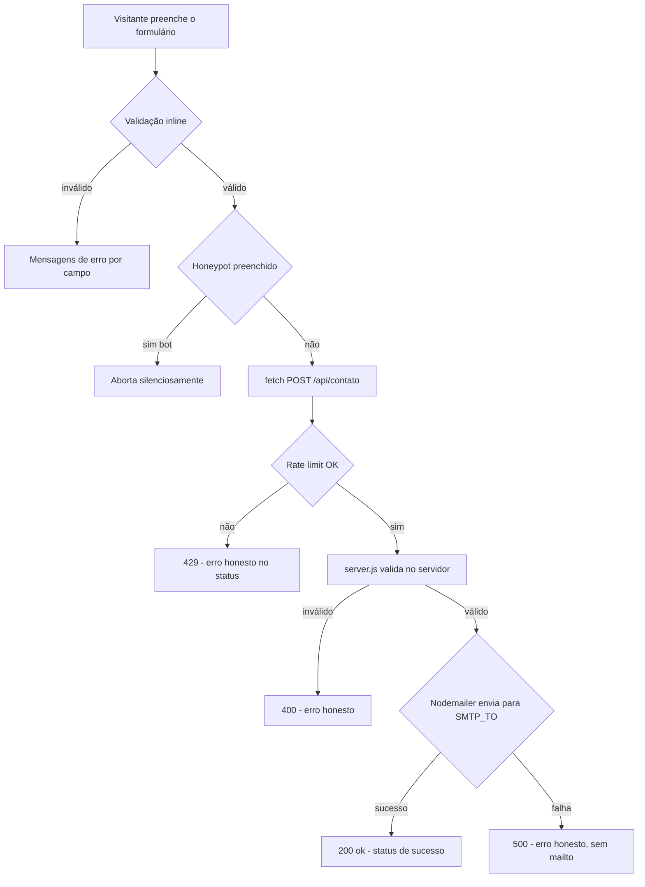

# Plano — Envio real de e-mail pelo formulário (Gmail SMTP)

## Objetivo

Entregar a mensagem do formulário de contato **diretamente ao e-mail do dono** via **SMTP (Nodemailer + Gmail)**, sem abrir o app de e-mail do visitante em nenhum cenário normal. Hoje o front já envia via `fetch` para `POST /api/contato`, mas o [`server.js`](server.js:49) apenas **valida e registra no log** (Fase A — sem SMTP). Este plano completa a entrega real e remove o fallback `mailto` que ainda poderia abrir o app do host.

## Estado atual (o que já existe)

- [`src/js/contato.js`](src/js/contato.js:57) — submete via `fetch` para `POST /api/contato` (não abre o app do host quando a API responde).
- [`server.js`](server.js:49) — valida os dados e `console.log` a mensagem; **não envia e-mail**.
- Fallback `mailto` em [`src/js/contato.js`](src/js/contato.js:35) — abre o app de e-mail do host quando a API falha.

## Decisões (aprovadas)

| Decisão | Escolha |
| --- | --- |
| Provedor SMTP | **Gmail** (`smtp.gmail.com`, porta 587, STARTTLS) com **App Password** |
| Credenciais | **Env vars do CloudPanel/PM2** (`SMTP_USER`, `SMTP_PASS`; `SMTP_TO` opcional) — **sem dotenv** |
| Fallback mailto | **Remover** — em falha da API, mostrar erro honesto sem abrir o app do host |
| Anti-spam | **Rate limit** (`express-rate-limit`) no endpoint + **honeypot** no formulário |

## Fluxo desejado



## Mudanças por arquivo

### `package.json`
- Adicionar **runtime dependencies**: `nodemailer` e `express-rate-limit` (devem entrar no `npm install --omit=dev` do servidor).

### `server.js`
1. `import nodemailer` e `import rateLimit`.
2. `app.set("trust proxy", 1)` — para o rate limit contar o IP real do visitante atrás do Nginx do CloudPanel.
3. Ler env vars:
   - `SMTP_USER` (conta Gmail — remetente)
   - `SMTP_PASS` (App Password do Gmail — requer 2FA)
   - `SMTP_TO` (destinatário; **default = `SMTP_USER`** — o próprio Gmail do dono)
4. Criar o transporter:
   ```js
   const transporter = nodemailer.createTransport({
     host: "smtp.gmail.com",
     port: 587,
     secure: false, // STARTTLS
     auth: { user: SMTP_USER, pass: SMTP_PASS },
   });
   ```
5. Aplicar `contatoLimiter` (ex.: **10 requisições / 15 min por IP**) na rota `POST /api/contato`.
6. Validar **honeypot** no corpo (`empresa`): se preenchido, responder `200 { ok: true }` **sem enviar** (o bot acha que funcionou).
7. Enviar o e-mail real com `transporter.sendMail(...)`:
   - `from: SMTP_USER`
   - `to: SMTP_TO`
   - `replyTo: <email do visitante>` (facilita responder direto)
   - `subject`: campo `assunto` enviado pelo front (assunto padrão + rótulo do tipo)
   - `text`: corpo formatado (nome, e-mail do visitante, tipo, mensagem, data/hora)
8. Tratamento de erro honesto:
   - Sem `SMTP_USER`/`SMTP_PASS` → **não finge envio**: `500 { ok: false, erro: ... }`.
   - Falha no `sendMail` → `500` com mensagem honesta (o front mostra o erro sem mailto).
9. Manter o `console.log` da mensagem recebida (auditoria).

### `src/js/contato.js`
- **Remover** `montarUrlMailto`, `abrirMailto` e o bloco `catch` que abre o mailto.
- No `catch`/falha da API: mostrar **erro honesto** no `role="status"` (ex.: "Não foi possível enviar agora. Tente novamente em instantes.") — sem abrir app de e-mail.
- Montar e enviar o campo `assunto` no payload do POST (assunto padrão de `data/contato.js` + rótulo legível do tipo escolhido), mantendo `data/contato.js` como fonte única do assunto/rótulos.
- Adicionar checagem de **honeypot**: se preenchido, abortar a submissão silenciosamente.
- Ajustar textos de status/erro removendo qualquer referência a "app de e-mail".

### `index.html`
- Adicionar **campo honeypot oculto** dentro do formulário:
  - `name="empresa"`, `autocomplete="off"`, `tabindex="-1"`, `aria-hidden="true"`, oculto via CSS (fora da viewport / `hidden`), sem `label` visível — atraente apenas para bots.
- Os textos da seção já comunicam "a mensagem chega direto ao meu e-mail" (sem menção a app de e-mail) — manter.

### `vite.config.js`
- Adicionar **proxy de dev**: `server.proxy: { "/api": "http://localhost:3001" }`.
- Permite testar o envio real no browser local com o Express rodando (`npm start`). O arquivo já é ignorado pelo SFTP (`sftp.json`), então não afeta produção.

### Documentação
- `DEPLOY.md`: seção com passo a passo — habilitar 2FA + criar App Password no Google, configurar `SMTP_USER`/`SMTP_PASS`/`SMTP_TO` como env vars do site no CloudPanel, reiniciar o processo Node, e nota de que a rota agora entrega o e-mail.
- `README.md` e `AI_GUIDELINES.md`: atualizar a stack/descrição para refletir Nodemailer + express-rate-limit e o envio real (Fase B concluída); registrar `nodemailer` como dependência permitida.

## Testes

1. **Local** (com Express + env vars no terminal):
   - `SMTP_USER=... SMTP_PASS=... SMTP_TO=... npm start`
   - `curl -X POST http://localhost:3001/api/contato -H 'Content-Type: application/json' -d '{"nome":"Teste","email":"t@t.com","tipo":"site","mensagem":"Mensagem de teste com mais de 10 caracteres","assunto":"Contato pelo portfólio — Site"}'`
   - Confirmar a chegada no Gmail e o `replyTo` correto.
2. **Navegador local**: `npm run dev` (proxy → 3001) e submeter o formulário real.
3. **Casos negativos**: honeypot preenchido (200 sem envio), validação inválida (400), rate limit excedido (429), SMTP sem credenciais (500 honesto).
4. **Produção**: configurar env vars no CloudPanel → **reiniciar o processo Node** → submeter o formulário em `https://jmattosdev.tech`.

## Riscos / notas

- **App Password** exige 2FA ativado na conta Gmail. Se a conta não tiver 2FA, não é possível gerar App Password (usar senha normal não é permitido pelo Gmail em 2026).
- Gmail impõe limites de envio (~500/dia). Envio **Gmail → Gmail** é o cenário mais confiável (sem risco de SPF/DKIM).
- Credenciais **nunca** no código/Git — apenas env vars do CloudPanel/PM2 (ou variáveis locais para teste).
- Após qualquer mudança em `server.js`, **reiniciar o processo Node** no CloudPanel (já documentado em `DEPLOY.md`).
