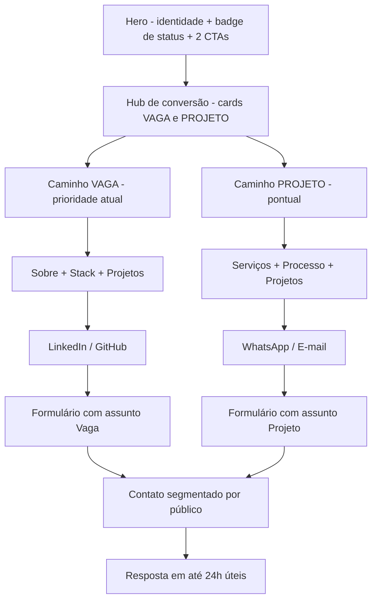

# Experiência de entrada — duplo caminho (VAGA x PROJETO)

> Foco deste documento: definir a **direção criativa/UX da tela inicial** do jmattos.dev,
> propondo alternativas de bifurcação para dois públicos — **recrutadores/entrevistadores**
> (avaliando perfil para vaga) e **clientes** (contratando site/serviço).
>
> Contexto de prioridade (confirmado pelo dono): **foco atual em oportunidades de emprego**,
> mas **aceita projetos pontuais**. Esse equilíbrio precisa aparecer claro para os dois públicos
> **sem atrapalhar a conversão**.
>
> Implementação futura: Tailwind v4 + dados centralizados em JS. Aqui, apenas direção visual/UX.

---

## 1. Estado atual (por que a entrada precisa mudar)

O hero atual ([`index.html`](index.html:116)) é um portfólio linear: nome + tagline + terminal
decorativo + dois CTAs genéricos ("Ver projetos" e "Entrar em contato", em [`index.html`](index.html:149)).
O visitante não é orientado: um recrutador e um cliente veem **exatamente a mesma coisa** e precisam
adivinhar onde clicar para o que querem. Não há estado de disponibilidade comunicado.

---

## 2. Princípios de design para a entrada

1. **Decisão em segundos**: o visitante identifica "esse lugar é para mim" em até ~2s.
2. **Próximo passo evidente**: cada público vê um CTA cujo resultado é óbvio.
3. **Honestidade de disponibilidade**: foco em vaga + projetos pontuais, sem esconder nem "fechar a porta".
4. **Priorização sem exclusão**: o caminho principal (vaga) tem destaque, mas o cliente não fica invisível.
5. **Sem esconder conteúdo** (SEO/descoberta): one-page estático deve manter tudo acessível a todos.
6. **Alinhado às diretrizes do projeto**: dados ≠ HTML, sem dependências novas, amarelo só como
   micro-acento, acessibilidade WCAG ([`AI_GUIDELINES.md`](AI_GUIDELINES.md:96)).

---

## 3. As três alternativas de entrada

### Alternativa A — Hero bifurcado (dois cards de decisão no próprio hero)

**Como fica:** o hero troca o "vitrine" por uma "porta de entrada". Nome + uma linha curta no topo
e, imediatamente abaixo, **dois cards lado a lado** (empilham no mobile). O terminal decorativo sai
do hero ou vira fundo discreto. Cada card é um caminho completo: ícone, selo de disponibilidade,
título-pergunta, 1–2 frases e CTAs.

| Card | Selo | Título | Microcopy (exemplo) | CTAs |
|---|---|---|---|---|
| VAGA | 🟢 Aberto a oportunidades | "Quer me contratar ou avaliar meu perfil?" | "Full Stack (Python/Django + React) com base em infra e redes, automação e projetos com código aberto. Perfil completo, pronto para conversar sobre a vaga." | "Ver perfil e portfólio" (#sobre) · "Enviar proposta de vaga" (#contato) |
| PROJETO | 🟡 Aceitando projetos pontuais | "Precisa de um site ou sistema?" | "Desenvolvimento web, APIs e automação de processos. Foco atual em vaga — aceito projetos pontuais, sempre sob conversa." | "Ver serviços" (#servicos) · "Solicitar orçamento" (#contato) |

**Prós**

- Decisão em <1s; zero ambiguidade; conversão por público muito alta.
- Fácil de implementar em one-page (cards = âncoras simples); acessível.
- Permite destacar visualmente o caminho prioritário (vaga) sem ocultar o cliente.

**Contras**

- "Pergunta" o visitante: quem chega esperando portfólio sente atrito ("por que estou escolhendo?").
- O hero perde o caráter de vitrine de marca (terminal/foto); parece mais landing page que portfólio.
- Dois CTAs concorrentes no mesmo espaço podem diluir o foco visual.

---

### Alternativa B — Seletor de público (tabs/toggle que adapta o conteúdo)

**Como fica:** o hero mantém a identidade (nome + terminal) e ganha um seletor
"Você é: **Recrutador** / **Cliente**". A seleção **reordena/adapta o conteúdo abaixo**: no modo
Recrutador, prioriza Sobre → Stack → Projetos e recolhe Serviços; no modo Cliente, prioriza
Serviços → Processo → Projetos. O rodapé e o formulário também se adaptam (assunto pré-selecionado).
Estado persistido em `localStorage` e/ou hash.

**Prós**

- Hero limpo e personalizado; forte sensação de "feito para mim".
- Reduz ruído: cada público vê apenas o que importa para ele.

**Contras**

- **Alta complexidade**: estado global, reordenação dinâmica das seções, padrão ARIA de tabs,
  persistência — contradiz o princípio YAGNI/KISS das diretrizes do projeto.
- **Conteúdo oculto prejudica SEO/descoberta**: em um SPA estático, quem compartilha a URL não vê
  o que o outro público veria; crawlers veem menos.
- **Efeito bolha**: um visitante híbrido (empresa que quer contratar E está avaliando para vaga)
  não vê tudo de uma vez.
- Mais manutenção e risco de bugs em um site cuja renderização é toda dirigida por JS.

---

### Alternativa C — Combinação (hero enxuto + hub de caminhos + adaptação leve por hash)

**Como fica:**

1. **Hero mantém identidade** (nome, tagline, terminal, foto) e ganha dois elementos:
   - um **badge de status** no topo resumindo os dois estados de disponibilidade;
   - **dois CTAs claros**: primário = "Oportunidades de vaga" (foco atual), secundário = "Contratar projeto/site".
2. Logo abaixo do hero, uma seção **hub de conversão `#caminhos`** com **2 cards detalhados**
   (mesmo conteúdo da Alternativa A, mas em seção própria — sem espremer o hero).
3. **Adaptação leve, sem esconder conteúdo**:
   - CTAs/hub usam âncoras `#vaga` / `#projeto` (e `?assunto=vaga|projeto`).
   - O parâmetro **pré-seleciona o assunto no formulário de contato** e rola até a seção certa.
   - Todo o conteúdo permanece visível a todos (SEO e visitante híbrido preservados).

**Prós**

- Equilíbrio ideal entre clareza e baixo atrito; mantém o hero como vitrine de marca.
- Prioriza vaga (foco atual) sem esconder o cliente; honesto sobre disponibilidade.
- Simples de implementar (sem estado global), robusto, acessível e SEO-friendly.
- **Alinha com o plano existente**: a seção `#caminhos` já é o item P0 de
  [`plans/otimizar-captacao-oportunidades.md`](plans/otimizar-captacao-oportunidades.md:1).

**Contras**

- Não personaliza o conteúdo dinamicamente (menos "uau" que o seletor B).
- Exige microcopy cuidadoso para não soar como "duplo foco" desfocado.

---

## 4. Microcopy e badges de disponibilidade

### 4.1 Badge de status no topo do hero (Alternativa C)

Um chip discreto acima do `H1` (no lugar/ao lado do rótulo `JMATTOS.DEV`), usando o micro-acento do
design system. Dois estados podem coexistir como dois chips ou um único chip com dois trechos:

- `🟢 Aberto a oportunidades de emprego · 🟡 Aceitando projetos pontuais`

> Cor: o verde (success) sinaliza o caminho prioritário; o amarelo (accent) fica **apenas como
> micro-acento discreto** no selo do caminho secundário — nunca como fundo grande (regra do projeto).

### 4.2 Estados por público (fonte única em `data/disponibilidade.js`)

| Público | ON | OFF |
|---|---|---|
| Vaga | Selo "Aberto a oportunidades" · CTA "Enviar proposta de vaga" | Selo "Vaga: sem abertura no momento" · CTA vira "Conhecer perfil" (LinkedIn/GitHub) |
| Projeto | Selo "Aceitando projetos pontuais" · CTA "Solicitar orçamento" | Selo "Agenda fechada para projetos" · CTA "Agendar conversa" (lista de espera) |

A alternância é **edição de dados** (novo `src/js/data/disponibilidade.js`), sem tocar em HTML —
consistente com a regra "dados ≠ HTML" do projeto.

### 4.3 Microcopy dos CTAs (convenção: verbo + resultado)

- "Oportunidades de vaga" (primário do hero)
- "Contratar projeto/site" (secundário do hero)
- "Enviar proposta de vaga" (recrutador)
- "Solicitar orçamento" (cliente)
- "Ver perfil completo" (recrutador → Sobre)
- "Ver serviços" (cliente → Serviços)

---

## 5. Navegação e estrutura conforme a escolha

### 5.1 Navegação (navbar)

- **Desktop** ([`index.html`](index.html:64)): manter as âncoras (Sobre, Stack, Projetos, Serviços,
  Contato) + **botão primário** "Vamos conversar" à direita (neutro, já usado no contato).
  A segmentação é feita pelo hub logo abaixo do hero — a navbar não precisa "escolher" público.
- **Mobile** ([`index.html`](index.html:90)): mesmo itens + dois destaques no topo do menu:
  "Oportunidades de vaga" e "Quero um projeto".

### 5.2 Estrutura da página (Alternativa C)

1. **Hero** — identidade + badge de status + 2 CTAs priorizados
2. **Hub `#caminhos`** — 2 cards (VAGA x PROJETO) com selos, microcopy e CTAs
3. **Sobre** — trajetória + "o que procuro" (evidência para recrutador)
4. **Stack** — evidência de capacidade
5. **Projetos** — evidência (estudos de caso)
6. **Serviços** — oferta para cliente (com CTA de orçamento)
7. **Processo** — como trabalho (confiança para ambos)
8. **Presença** — LinkedIn, GitHub, e-mail, WhatsApp
9. **Contato** — formulário com assunto pré-selecionável (`?assunto=vaga|projeto`)
10. **Rodapé** — 2 blocos de caminho (Para recrutadores / Para clientes)

### 5.3 Comportamento ao escolher

- **Clique em VAGA** → rola para o hub/card VAGA e, ao chegar no contato, o formulário já abre com
  "Assunto: Proposta de vaga".
- **Clique em PROJETO** → rola para Serviços e o formulário já abre com "Assunto: Contratar serviço".
- **Sem clique (scroll natural)** → ambos os caminhos continuam visíveis na página; ninguém é
  bloqueado (bom para SEO e para visitante híbrido).

---

## 6. Comparação rápida

| Critério | A (hero bifurcado) | B (seletor) | C (combinação) |
|---|---|---|---|
| Clareza do próximo passo | Alta | Média | Alta |
| Atrito de entrada | Médio (pergunta) | Baixo | Baixo |
| Identidade de portfólio | Perde | Mantém | Mantém |
| Complexidade de implementação | Baixa | Alta | Baixa |
| SEO / descoberta | Bom | Ruim (oculta) | Bom |
| Prioriza vaga sem esconder cliente | Sim | Parcial | Sim |
| Alinhamento ao plano existente | Parcial | Parcial | **Direto** |

---

## 7. Recomendação final

**Adotar a Alternativa C (combinação)**, com os seguintes refinamentos:

1. **Hero enxuto** com badge de status e dois CTAs priorizados (vaga primário, projeto secundário),
   mantendo o terminal/foto como vitrine de marca.
2. **Hub `#caminhos`** logo abaixo do hero como o elemento central de bifurcação — dois cards com
   selos de disponibilidade, microcopy honesto e CTAs.
3. **Adaptação leve por hash** (`?assunto=vaga|projeto`): pré-seleciona o assunto do formulário e
   rola até a seção relevante, sem ocultar conteúdo.
4. **Badges orientados à prioridade atual**: vaga "aberto" (destaque) + projeto "pontual sob consulta"
   (gerencia expectativa sem fechar a porta) — ambos alternáveis por arquivo de dados.

Justificativa: a C entrega clareza de decisão (como a A) sem sacrificar a identidade de portfólio,
evita a complexidade e o risco de SEO do seletor (B) e é a única que **conecta diretamente com o
plano P0 já desenhado** em [`plans/otimizar-captacao-oportunidades.md`](plans/otimizar-captacao-oportunidades.md:1)
— o que reduz trabalho e mantém consistência.

---

## 8. Próximos passos

- [ ] Confirmar a direção (A, B ou C — recomendação: C).
- [ ] Incorporar os textos/microcopy aprovados em `src/js/data/disponibilidade.js` e no hub `#caminhos`.
- [ ] Atualizar [`plans/otimizar-captacao-oportunidades.md`](plans/otimizar-captacao-oportunidades.md:1)
      com a direção de entrada escolhida.
- [ ] Seguir para implementação em modo Code (fases P0/P1 do plano).

---

© JMATTOS.DEV — direção criativa da experiência de entrada.
