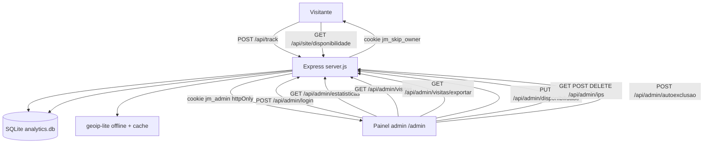

# Plano — Painel Administrativo + Analytics (JMATTOS.DEV)

> **Objetivo:** monitorar acessos ao site e controlar dinamicamente a disponibilidade
> ("Aberto a oportunidades de emprego" e "Aceitando projetos") por um painel privado,
> acessível por link discreto no rodapé e protegido por autenticação.
>
> **Decisão de arquitetura aprovada:** estender o Express existente ([`server.js`](server.js:1))
> na VPS com persistência em **SQLite** (`better-sqlite3`) e geolocalização **offline** (`geoip-lite`).
> Nenhum serviço externo (Supabase/Firebase/Functions de terceiros).

---

## 1. Contexto / estado atual

- Site SPA estático ([`index.html`](index.html:1)) servido por Express na VPS (CloudPanel).
- Já existe backend [`server.js`](server.js:1) com `POST /api/contato` — o ponto de extensão natural.
- Disponibilidade é **estática** em [`src/js/data/disponibilidade.js`](src/js/data/disponibilidade.js:15)
  (importada no bundle) e renderizada por [`src/js/disponibilidade.js`](src/js/disponibilidade.js:145).
- Deploy: build → `dist/` → SFTP → VPS; o `sftp.json` **ignora `src/` e `public/`**, mas envia a raiz
  do projeto (inclusive uma pasta nova `server/`). `npm install --omit=dev` roda na VPS ([`DEPLOY.md`](DEPLOY.md:1)).
- As [`AI_GUIDELINES.md`](AI_GUIDELINES.md:230) hoje proíbem banco de dados — **este pedido supera essa regra**
  e exigirá atualização das guidelines (ver §13).

---

## 2. Arquitetura geral



**Decisões-chave:**

| Ponto | Decisão | Justificativa |
|---|---|---|
| Backend | Estender o Express da VPS | Site já roda em VPS própria; zero serviço externo |
| Banco | SQLite (`better-sqlite3`) | Embarcado, sem processo separado, agregações SQL simples, leve para volume pessoal |
| Geo | `geoip-lite` (offline) + tabela de cache | Sem API externa, sem custo/rate-limit; cache evita reconsulta |
| Sessão admin | Cookie `httpOnly` + `SameSite=Strict` + token aleatório com hash no banco | Evita XSS; mesmo-origin mitiga CSRF |
| Senha | Única, via variável de ambiente, hash `crypto.scrypt` | Single-admin; sem framework |
| Rastreamento | `POST /api/track` com `sendBeacon`/`fetch keepalive` | Simples, não bloqueia navegação |
| Gráficos | Chart.js **apenas no bundle do admin** (página separada) | Painel fica rico; site público continua leve |
| Tempo real | Re-busca no foco da aba + polling 30–60s (v1); SSE opcional (v2) | Reflete mudanças sem reload |

---

## 3. Banco de dados (schema SQLite)

Arquivo: `server/data/analytics.db` (criado automaticamente; ignorado no Git).

```sql
-- Acessos rastreados (uma linha por pageview)
CREATE TABLE IF NOT EXISTS visitas (
  id          INTEGER PRIMARY KEY AUTOINCREMENT,
  ts          TEXT NOT NULL,             -- ISO 8601 UTC
  data        TEXT NOT NULL,             -- YYYY-MM-DD (UTC)
  hora_utc    INTEGER NOT NULL,          -- 0-23 (UTC)
  hora_local  INTEGER NOT NULL,          -- 0-23 (fuso do visitante, p/ horários de pico)
  caminho     TEXT NOT NULL,             -- pathname
  referencia  TEXT,                      -- document.referrer (origem)
  origem      TEXT,                      -- direct | google | linkedin | github | whatsapp | outro
  ip          TEXT,
  ua          TEXT,                      -- user-agent
  session_id  TEXT,                      -- cookie uuid do visitante (1 ano)
  dispositivo TEXT,                      -- mobile | desktop | tablet
  navegador   TEXT,                      -- Chrome | Firefox | Safari | Edge | ...
  so          TEXT,                      -- Windows | Android | iOS | macOS | Linux
  pais        TEXT,
  regiao      TEXT,
  cidade      TEXT,
  tela        TEXT,                      -- ex.: 1920x1080
  excluida    INTEGER NOT NULL DEFAULT 0 -- 1 = acesso do dono (autoexclusão) ou IP bloqueado
);
CREATE INDEX IF NOT EXISTS idx_visitas_data   ON visitas(data);
CREATE INDEX IF NOT EXISTS idx_visitas_sessao ON visitas(session_id);
CREATE INDEX IF NOT EXISTS idx_visitas_caminho ON visitas(caminho);

-- Eventos de conversão (opcional, v1 leve): clique em CTA, envio do formulário, scroll profundo
CREATE TABLE IF NOT EXISTS eventos (
  id       INTEGER PRIMARY KEY AUTOINCREMENT,
  visit_id INTEGER,
  ts       TEXT NOT NULL,
  tipo     TEXT NOT NULL,   -- cta_clique | formulario_enviado | scroll_90
  detalhe  TEXT
);

-- Configuração de disponibilidade (uma única linha, id = 1)
CREATE TABLE IF NOT EXISTS disponibilidade (
  id                INTEGER PRIMARY KEY CHECK (id = 1),
  aberto_para_vaga  INTEGER NOT NULL DEFAULT 1,
  aceitando_projetos INTEGER NOT NULL DEFAULT 1,
  atualizado_em     TEXT NOT NULL
);

-- Blacklist de IPs (nunca contabilizados / bloqueados do tracking)
CREATE TABLE IF NOT EXISTS ip_bloqueados (
  ip        TEXT PRIMARY KEY,
  motivo    TEXT,
  criado_em TEXT NOT NULL
);

-- Sessões administrativas (hash do token; sem token em texto no banco)
CREATE TABLE IF NOT EXISTS sessoes_admin (
  token_hash TEXT PRIMARY KEY,
  criado_em  TEXT NOT NULL,
  expira_em  TEXT NOT NULL
);

-- Cache de geolocalização por IP (evita reconsultas ao geoip-lite)
CREATE TABLE IF NOT EXISTS geo_cache (
  ip            TEXT PRIMARY KEY,
  pais TEXT, regiao TEXT, cidade TEXT,
  consultado_em TEXT NOT NULL
);
```

> **Seed de disponibilidade:** na primeira execução, o servidor insere a linha `id=1` com os valores
> atuais do site (`abertoParaVaga: true`, `aceitandoProjetos: true`). O painel passa a ser a
> **autoridade**; o arquivo [`src/js/data/disponibilidade.js`](src/js/data/disponibilidade.js:15) vira
> apenas fallback offline de renderização.

---

## 4. Endpoints (API)

### Públicos

| Método | Rota | Descrição |
|---|---|---|
| `POST` | `/api/track` | Registra pageview. Body: `{ caminho, referencia, session_id, tela, hora_local }`. Servidor lê `User-Agent`, `IP` (via `x-forwarded-for` + `trust proxy`) e cookies. Se cookie `jm_skip_owner` OU IP na blacklist → `excluida=1`. Resolve geo (cache → `geoip-lite`). Retorna `204`. |
| `GET` | `/api/site/disponibilidade` | Estado público de disponibilidade + rótulos (usado pelo site para refletir os toggles sem recarregar o bundle). |

### Admin (protegidos por sessão — middleware `requerSessao`)

| Método | Rota | Descrição |
|---|---|---|
| `POST` | `/api/admin/login` | Body `{ senha }` → valida via `scrypt` → cria sessão → seta cookie `jm_admin`. Rate-limit anti brute-force. |
| `POST` | `/api/admin/logout` | Invalida sessão e limpa cookie. |
| `GET` | `/api/admin/me` | `{ autenticado: true }` ou `401`. |
| `GET` | `/api/admin/estatisticas?de=YYYY-MM-DD&ate=YYYY-MM-DD` | Agregados do período: totais, série diária, páginas top, dispositivos, navegadores, SO, países, cidades, origens, horários de pico. |
| `GET` | `/api/admin/visitas?de=&ate=&limite=&offset=` | Lista paginada dos acessos recentes (tabela do painel). |
| `GET` | `/api/admin/visitas/exportar?de=&ate=` | CSV (`Content-Disposition: attachment`). |
| `GET` | `/api/admin/disponibilidade` | Estado atual da configuração. |
| `PUT` | `/api/admin/disponibilidade` | Body `{ abertoParaVaga, aceitandoProjetos }` → salva no banco. |
| `GET` | `/api/admin/ips` | Lista de IPs bloqueados. |
| `POST` | `/api/admin/ips` | Body `{ ip, motivo }` → adiciona à blacklist. |
| `DELETE` | `/api/admin/ips/:ip` | Remove da blacklist. |
| `POST` | `/api/admin/autoexclusao` | Body `{ ativo }` → seta/expira o cookie `jm_skip_owner` no navegador do dono ("não contar minhas visitas neste navegador"). |

> **Opcional (v2):** `GET /api/admin/eventos` em **SSE** notifica novos acessos no painel aberto.

---

## 5. Fluxo de autenticação

```mermaid
sequenceDiagram
    participant N as Navegador do dono
    participant S as Express
    participant DB as SQLite

    N->>S: POST /api/admin/login com senha
    S->>S: scrypt da senha == ADMIN_SENHA_HASH
    S->>DB: insere token aleatório (hash) + expiração
    S-->>N: Set-Cookie jm_admin = token; HttpOnly; Secure; SameSite=Strict
    N->>S: GET /api/admin/estatisticas com cookie
    S->>DB: valida hash do token na tabela sessoes_admin
    S-->>N: 200 JSON (ou 401 se ausente/expirada)
```

- **Senha:** variável de ambiente `ADMIN_SENHA` (ou `ADMIN_SENHA_HASH`). Hash com
  `crypto.scrypt` + salt (padrão `scrypt$N$r$p$salt$hash`), nunca em texto puro.
- **Sessão:** token de 32 bytes (`crypto.randomBytes`) com hash `sha256` na tabela;
  expiração de 7 dias; renovação em cada uso (sliding). Cookie `HttpOnly; Secure; SameSite=Strict`.
- **CSRF:** `SameSite=Strict` + checagem de `Origin`/`Referer` nos endpoints de mutação do admin.
- **Rate-limit:** login limitado (ex.: 5 tentativas / 15 min por IP) e `/api/track` limitado
  (ex.: 60 req/min por IP) — implementação manual em memória (sem dependência).
- **Brute-force defensivo:** atraso constante na resposta de login (mitiga timing).

---

## 6. Rastreamento no front-end + exclusão do acesso do dono

### 6.1 Novo `src/js/track.js`

- No load da SPA, monta payload `{ caminho: location.pathname, referencia: document.referrer,
  session_id, tela: screen.width + 'x' + screen.height, hora_local: new Date().getHours() }`.
- `session_id`: uuid persistente em cookie próprio `jm_vid` (1 ano) → **visitantes únicos**.
- Envio com `navigator.sendBeacon('/api/track', blob)` (fallback `fetch keepalive`), `fire-and-forget`.
- **Desativado em dev** via `import.meta.env.DEV` (evita poluir o banco local); ativo em produção.
- **Respeita `navigator.doNotTrack === '1'`** (não envia) — boa prática de privacidade.
- Opcional (v1 leve): eventos de conversão — `POST /api/track` com `{ evento: 'cta_clique' | 'formulario_enviado' }`
  nos cliques de CTA ([`data-cta-hero-*`](index.html:178), [`data-caminho`](index.html:179)) e no envio do formulário
  ([`src/js/contato.js`](src/js/contato.js:289)) → alimenta a tabela `eventos` (taxa de conversão aproximada).

### 6.2 Como ocultar o acesso do dono (combinação)

| Mecanismo | Como funciona | Uso |
|---|---|---|
| **Cookie `jm_skip_owner`** (principal) | Toggle no painel → `POST /api/admin/autoexclusao` seta cookie `HttpOnly` no navegador do dono; `POST /api/track` marca `excluida=1`. | Funciona com IP dinâmico; cobre o navegador usado para administrar |
| **Blacklist de IP** (backup) | IPs fixos do dono (ex.: empresa) adicionados em `ip_bloqueados` pelo painel. | Navegação a partir de máquinas/redes fixas |
| **Sessão admin ativa** | (Bônus) se o cookie de sessão `jm_admin` estiver presente no `/api/track`, também marca `excluida=1`. | Cobre o caso de navegar com o painel aberto |

As estatísticas **sempre filtram** `WHERE excluida = 0` — o registro permanece no banco (auditável),
mas nunca entra nas métricas.

---

## 7. Disponibilidade dinâmica (integração front-end)

1. **Servidor** expõe `GET /api/site/disponibilidade` → lê a linha `id=1` do banco e retorna
   `{ abertoParaVaga, aceitandoProjetos }` (valores numéricos convertidos para boolean).
2. **Front** — alterar [`src/js/disponibilidade.js`](src/js/disponibilidade.js:145):
   - `initDisponibilidade()` passa a **buscar o estado remoto primeiro** (`fetch` com timeout ~2.5s);
   - se a API responder → mescla os valores remotos por cima do objeto local;
   - se falhar (offline/dev sem servidor) → usa os valores locais de `data/disponibilidade.js` (fallback);
   - em seguida executa a renderização atual (badges, CTAs do Hero, hub `#caminhos`, rodapé) — **sem mudar** a lógica de renderização já existente.
3. **"Refletir imediatamente":** re-busca no `visibilitychange` (quando a aba ganha foco) + polling leve
   a cada 60s; assim, ao salvar um toggle no painel, o site aberto em outra aba atualiza sem reload.
   (SSE opcional na v2 para atualização em tempo real.)
4. **Persistência:** o painel salva via `PUT /api/admin/disponibilidade`; como todo visitante lê o mesmo
   banco, o estado é **consistente para todos** e sobrevive a recarregamentos.

> **Importante:** `data/disponibilidade.js` deixa de ser a fonte de verdade do estado **dinâmico**, mas
> continua como seed/fallback. Os textos de rótulos/CTAs podem permanecer no arquivo local (renderização),
> enquanto apenas os dois booleanos são sobrescritos pelo servidor.

---

## 8. Painel admin (interface)

Página separada `admin.html` (segunda entrada do Vite — multi-page). Protegida nas APIs; a página
carrega, chama `GET /api/admin/me` e exibe o **login** se `401` (sem revelar dados).

**Tela de login:** card central, campo senha, mensagem de erro em pt-BR, `role="status"` para
leitores de tela, bloqueio visual após tentativas.

**Dashboard (layout responsivo — sidebar no desktop, top bar no mobile):**

| Área | Conteúdo |
|---|---|
| **KPIs (cards)** | Visitas hoje · Visitas no período · Visitantes únicos · Páginas únicas |
| **Tendência** | Gráfico de linha — visitas por dia (intervalo selecionado) |
| **Páginas mais acessadas** | Gráfico de barras + lista |
| **Dispositivos / Navegadores / SO** | Gráfico de rosca (donut) |
| **Geografia** | Tabela países/cidades (top) |
| **Horários de pico** | Barras por hora do dia (fuso do visitante) |
| **Origens** | direct / google / linkedin / github / whatsapp / outro |
| **Tabela de acessos recentes** | data, hora, IP, país, dispositivo, navegador, página, origem (paginada) |
| **Filtros** | Período (hoje, 7d, 30d, personalizado), página, origem |
| **Disponibilidade (toggles)** | Switches "Aberto a oportunidades de emprego" e "Aceitando projetos" → salvam via `PUT` com feedback de status (salvo/erro) |
| **Meus acessos** | Toggle "Não registrar minhas visitas neste navegador" (autoexclusão) + gestão da blacklist de IPs |
| **Exportar CSV** | Botão que baixa as visitas do período filtrado |

**Decisões visuais:** seguir os tokens do projeto (tema dark, `surface`, `primary`, `accent` só como
micro-acento, `rounded-xl`, `shadow-card`); painel responsivo (grid de cards colapsa para 1 coluna no
mobile); acessibilidade (labels, foco visível, `prefers-reduced-motion`). Gráficos com Chart.js no
**bundle do admin** (não entra no bundle público).

---

## 9. Métricas e insights extras (além de contagem e localização)

| Métrica/insight | Viabilidade | Como |
|---|---|---|
| **Filtros por data/período** | ✅ v1 | `de`/`ate` nas APIs de estatísticas/visitas/CSV |
| **Exportação CSV** | ✅ v1 | Endpoint dedicado |
| **Bloqueio de IPs** | ✅ v1 | Blacklist no tracking + gestão no painel |
| **Alertas em tempo real** | 🟡 v2 | SSE (`/api/admin/eventos`) notifica novo acesso no painel aberto |
| **Painel responsivo** | ✅ v1 | Layout responsivo |
| **Origem do tráfego** | ✅ v1 | `document.referrer` agrupado (direct, google, linkedin, github, whatsapp…) |
| **Horários de pico** | ✅ v1 | `hora_local` (fuso do visitante) agregada por hora |
| **Novos vs. recorrentes** | ✅ v1 | `session_id` (cookie 1 ano) → segmentação visitante único vs. retorno |
| **Tendência semanal/mensal** | ✅ v1 | Série diária agregada por semana/mês |
| **Conversão aproximada** | 🟡 v1 leve | Eventos `cta_clique`/`formulario_enviado` (taxa de conversão por visita) |
| **Mapa geográfico** | 🔵 v2 | `geoip-lite` fornece lat/long — mapa simples por país |
| **Tempo médio na página / profundidade** | 🔵 v2 | Requer heartbeats periódicos (mais complexo) |
| **Dias da semana mais movimentados** | ✅ v1 | `strftime('%w', ts)` na agregação |

---

## 10. Segurança e privacidade

- **Dados sensíveis:** IP + localização são dados pessoais → adicionar **política de privacidade**
  (seção curta no rodapé/site) informando coleta, finalidade (análise de tráfego) e retenção.
- **Retenção:** job de limpeza opcional (ex.: apagar visitas com mais de 12 meses via comando npm
  `npm run limpar-dados` ou função no admin).
- **Do Not Track** respeitado no tracking; cookie `jm_vid` informado na política.
- **Não vender/compartilhar** dados; armazenamento local na própria VPS.
- **Painel:** `robots.txt` com `Disallow: /admin`; senha forte via env; rate-limit; cookies seguros;
  checagem de Origin em mutações; nunca logar senha.

---

## 11. Estrutura de arquivos

### Novos

```
server/
├── db.js            # Conexão SQLite + schema + seed de disponibilidade
├── auth.js          # scrypt, sessões (tabela), middleware requerSessao, rate-limit
├── geo.js           # geoip-lite + cache (tabela geo_cache)
├── analytics.js     # Consultas de agregação (estatísticas, visitas, CSV)
├── routes-site.js   # POST /api/track · GET /api/site/disponibilidade
├── routes-admin.js  # Login/logout/me · estatísticas · visitas · CSV · disponibilidade · ips · autoexclusao
└── data/            # analytics.db (gerado em runtime; .gitignored)

admin.html                          # Página do painel (entrada Vite)
.env.example                        # ADMIN_SENHA, PORT, etc.
src/js/track.js                     # Rastreamento do site público
src/js/admin/
├── main.js                         # Bootstrap do painel (verifica sessão → login ou dashboard)
├── login.js                        # Tela de login
├── api.js                          # Cliente fetch (JSON, autenticação via cookie)
├── dashboard.js                    # KPIs + montagem das seções
├── graficos.js                     # Chart.js (linha, barras, rosca)
├── disponibilidade-admin.js        # Toggles de disponibilidade
├── ips.js                          # Blacklist de IPs + autoexclusão
└── exportar.js                     # Download de CSV
```

### Modificados

| Arquivo | Mudança |
|---|---|
| [`server.js`](server.js:1) | `app.set('trust proxy', 1)`; importa e monta `routes-site` e `routes-admin`; serve `/admin`; mantém `/api/contato` e `dist/` |
| [`vite.config.js`](vite.config.js:1) | Multi-page: entradas `index.html` e `admin.html` |
| [`src/js/main.js`](src/js/main.js:1) | Importa `track.js`; `initDisponibilidade()` passa a carregar estado remoto |
| [`src/js/disponibilidade.js`](src/js/disponibilidade.js:1) | Busca estado remoto com fallback local |
| [`index.html`](index.html:838) | Link **discreto** no rodapé → `/admin` (texto pequeno/muted, ex.: "Painel") |
| [`package.json`](package.json:1) | Deps: `better-sqlite3`, `geoip-lite`, `chart.js`; dev: `dotenv` |
| [`DEPLOY.md`](DEPLOY.md:1) | Env vars na VPS, `npm install` (novas deps), reinício do processo Node, nota sobre `server/` |
| [`AI_GUIDELINES.md`](AI_GUIDELINES.md:1) | Atualizar regra de banco (permitido para o painel) e estrutura |
| [`README.md`](README.md:1) | Documentar o painel e as novas pastas |
| [`.gitignore`](.gitignore:1) | Ignorar `server/data/*.db` e `.env` |

> **Atenção deploy:** os módulos em `server/` ficam **na raiz** do projeto (não em `src/`), pois o
> [`sftp.json`](.vscode/sftp.json:81) ignora `src/` — a pasta `server/` é enviada ao web root por padrão.

---

## 12. Implementação passo a passo

- [x] **Decisão de arquitetura** (Express + SQLite + geoip offline) — confirmada
- [ ] **1. Backend base**
  - [ ] Adicionar deps: `better-sqlite3`, `geoip-lite`, `chart.js` (runtime) e `dotenv` (dev)
  - [ ] Criar `server/db.js` (conexão, schema, seed de disponibilidade)
  - [ ] Criar `server/auth.js` (scrypt, sessões, middleware, rate-limit)
  - [ ] Criar `server/geo.js` (geoip-lite + cache)
  - [ ] Criar `server/analytics.js` (agregações SQL)
  - [ ] Criar `server/routes-site.js` (`POST /api/track` + `GET /api/site/disponibilidade`)
  - [ ] Criar `server/routes-admin.js` (login/me/logout, estatísticas, visitas, exportar, disponibilidade, ips, autoexclusão)
  - [ ] Integrar em `server.js` (trust proxy, montar rotas, servir `/admin`)
- [ ] **2. Front público**
  - [ ] Criar `src/js/track.js` (pageview + eventos; session `jm_vid`; desligado em dev; DNT)
  - [ ] Integrar `track.js` em `src/js/main.js`
  - [ ] Alterar `src/js/disponibilidade.js` para carregar estado remoto com fallback local
- [ ] **3. Painel admin**
  - [ ] Configurar multi-page no `vite.config.js` (`admin.html`)
  - [ ] Criar `admin.html` (layout responsivo, tema dark do projeto)
  - [ ] Criar `src/js/admin/*` (api, login, dashboard, gráficos, disponibilidade, ips, exportar)
  - [ ] Adicionar link discreto `/admin` no rodapé de `index.html`
- [ ] **4. Segurança / privacidade**
  - [ ] Rate-limit de login e de `/api/track`; checagem de Origin nas mutações
  - [ ] `robots.txt`: `Disallow: /admin`
  - [ ] Nota de política de privacidade (coleta de IP/localização e cookies de analytics)
  - [ ] `.env.example` + `.gitignore` (`server/data/*.db`, `.env`)
- [ ] **5. Documentação / deploy**
  - [ ] Atualizar `DEPLOY.md` (env vars, `npm install` na VPS, reinício do Node, pasta `server/`)
  - [ ] Atualizar `AI_GUIDELINES.md` e `README.md`
- [ ] **6. Testes**
  - [ ] `npm run dev` + `node server.js` local: track → estatísticas → toggles refletem no site → login → autoexclusão → CSV → blacklist
  - [ ] `npm run build` + `npm run preview` (site público e painel)
  - [ ] Deploy na VPS e validação em produção

---

## 13. Decisões a confirmar (recomendações)

1. **Gráficos:** recomendado **Chart.js no bundle do admin** (painel separado; site público intacto).
   Alternativa zero-dep: gráficos SVG/CSS nativos (barras/linha simples).
2. **Tempo real:** v1 com re-busca no foco da aba + polling 60s; **SSE** entra como v2 opcional.
3. **Senha inicial:** definir `ADMIN_SENHA` no ambiente da VPS (CloudPanel/PM2) ou `.env` local com `dotenv`.
4. **Retenção de dados:** manter por padrão e adicionar comando de limpeza manual (sem job automático na v1).

---

## 14. Fora de escopo (v1)

- Mapa geográfico interativo e tempo médio na página (v2).
- Múltiplos usuários/roles no painel (single-admin).
- Integração com serviços de e-mail/notificação externos.
- Migração de plataforma de hospedagem.
